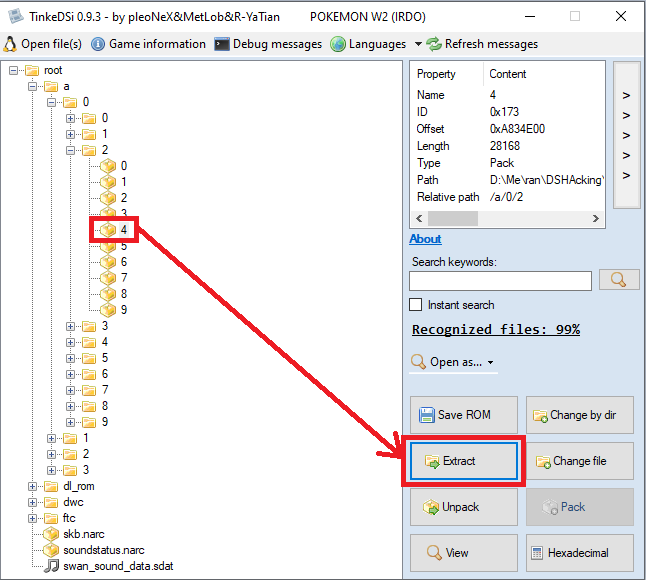
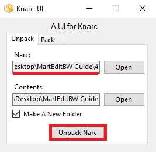
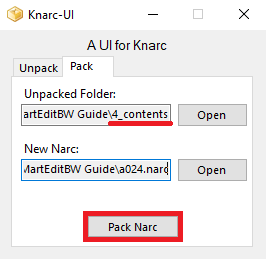
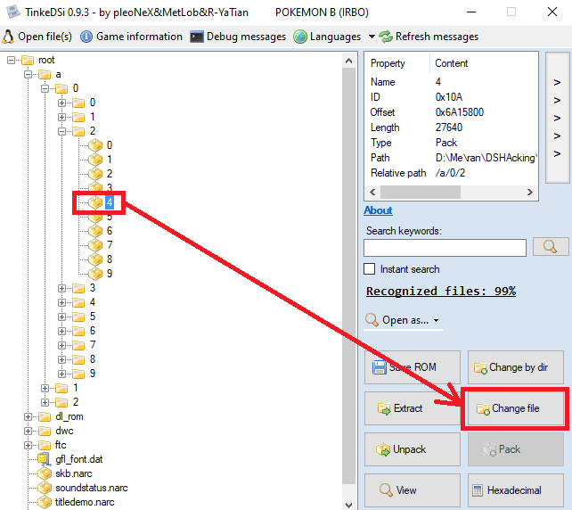

# MartEditBW
version 0.2

MartEditBW allows to edit the items of every shop  in Black/White (untested in White tbh) and edit the price of every item.        
This app does not support adding additional items to the shop or editing BP price.       
Ignore the fact that some Tinke screenshots say Pokemon White 2, I'm a dumbass. (You should find the same files in the same place when you open the correct ROM)

If the application fails to open try installing the [VC redistribution](https://learn.microsoft.com/en-us/cpp/windows/latest-supported-vc-redist?view=msvc-170)

## Required Tools

1. Download [TinkeDSi](https://github.com/R-YaTian/TinkeDSi/releases)
2. Download [Knarc-UI](https://github.com/dev-cyw/Knarc-UI/releases)
3. Download [Nintendo_DS_Compressors](https://www.romhacking.net/utilities/826/)
4. Download [HxD](https://mh-nexus.de/en/hxd/)

## Item Tab
### __THESE STEPS ONLY HAS TO BE PERFORMED ONCE PER ROM:__

1. Extract file ``y9.bin`` using Tinke         

2. Open the file ``y9.bin`` using HxD
3. Go to the line ``000002B0`` and change the last byte from ``03`` to ``00`` (THE IMAGE IS WRONG)           

4. Save the ``y9.bin`` file in HxD
5. Reimport the ``y9.bin`` file into your ROM using Tinke

### __THESE STEPS HAVE TO BE PERFORMED EVERYTIME YOU MAKE CHANGES TO THE MARTS:__

1. Extract file ``overlay9_21`` using Tinke           

2. Open a cmd console in the folder where you stored the Nintendo_DS_Compressors tools               

3. From the command console use the ``blz`` exe with the decompress option (``-d``) on the ``overlay9_21`` file:
  - The generic command is ``blz.exe -d [your overlay path]/overlay9_21``
  - Since I have the ``blz.exe`` and ``overlay9_21`` in the same forlder, and I opened the cmd from that folder the command I need to use is ``blz.exe -d overlay9_21``            

4. Open MartEditBW and in the Item tab use the ``...`` button find and select the ``overlay9_21`` file
5. All the marts should load and you can now change the items in them (remember you have to Save after each mart modification)
6. Once you have applied the changes you want, reimport the ``overlay9_21`` file into your ROM using Tinke            

## Price Tab
1. Extract file ``4`` (a -> 0 -> 2 -> 4) using Tinke             

2. Use Knarc-UI to extract all the Item Data files (Make sure the NARC file is called "4" and that you check the ``Make A New Folder`` checkbox)         

3. Open MartEditBW and in the Price tab use the ``...`` button find and select the ``4_contents`` folder
4. All the items should load and you can now change the price of any item you want (prices must be divisible by 10)
5. Once you have applied the changes you want, use Knarc-UI to pack the Item Data files into a NARC file again        

6. Reimport the packed NARC file into your ROM using Tinke         

